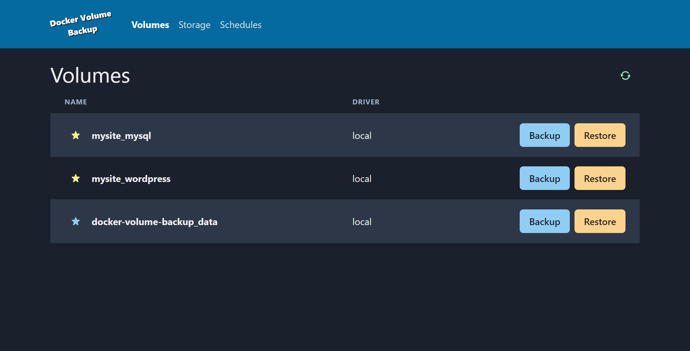
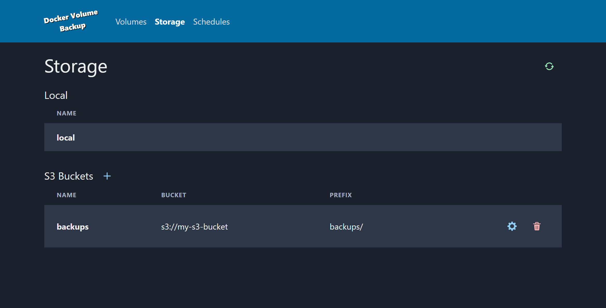
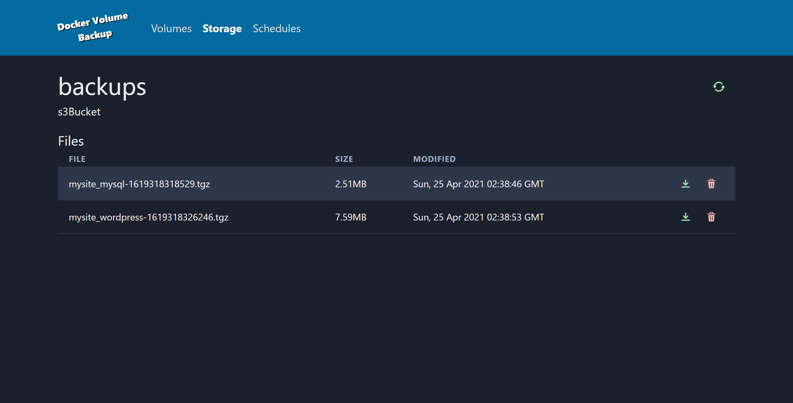
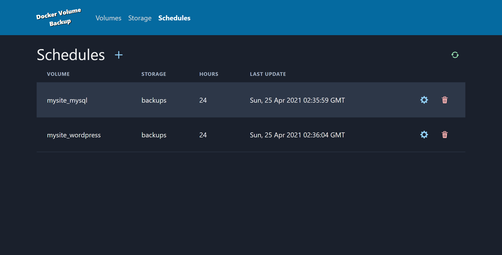

# Docker Volume Backup

Web based docker volume backup utility for backing up volume data to an S3 bucket or local filesystem. It works well enough for my needs but I might improve it further, see [#1](https://github.com/jabuwu/docker-volume-backup/issues/1).

## Building

Check out the `docker-compose.yml` file for recommended deployment. The `AUTH_USERNAME` and `AUTH_PASSWORD` environment variables are optional. If provided, they will enable nginx basic auth with the given username/password.

## Screenshots

